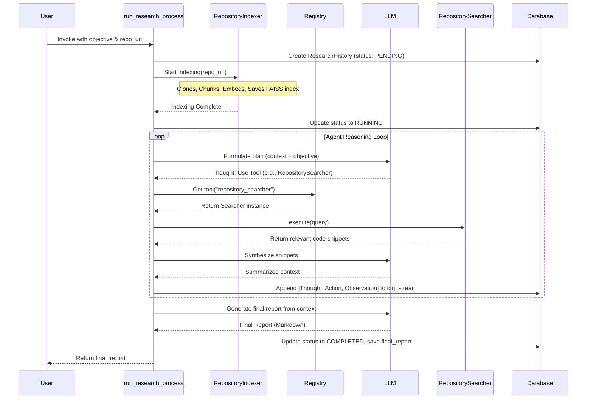

# Singularity.IO System Architecture: A Deep Dive

## 1. Architectural Principles

The Singularity.IO architecture is founded on principles selected to optimize for long-term maintainability, scalability, and extensibility in a rapidly evolving AI landscape.

#### 1.1. Modularity & Extensibility via Service Location
**Principle:** Components must be decoupled and dynamically discovered.
**Implementation:** The core of our modular design is the `Registry`, a manifestation of the Service Locator pattern. Instead of using a complex dependency injection framework, which can introduce overhead and obscure dependency graphs, we opted for a simple, explicit dictionary-based registry.
- **Trade-off:** This approach sacrifices automatic dependency resolution and lifecycle management for simplicity, transparency, and ease of debugging. For the current stage of the project, this trade-off is advantageous.
- **Example - Registering a Custom Tool:**
  ```python
  # in my_tool.py
  from singularity_io.agent.registry import Registry, Tool

  @Registry.register_tool("custom_file_writer")
  class CustomFileWriter(Tool):
      async def execute(self, file_path: str, content: str) -> str:
          # ... implementation ...
          return "Successfully wrote file."
  ```
  The `@Registry.register_tool` decorator automatically adds the `CustomFileWriter` class to the registry under the key `"custom_file_writer"`, making it immediately available to any agent process without changes to consumer code.

#### 1.2. Asynchronicity for I/O-Bound Concurrency
**Principle:** The system must remain responsive and efficient during high-latency operations.
**Implementation:** The entire codebase is built on Python's `asyncio` library. All operations that involve waiting for external resources—such as LLM API calls (`aiohttp`), database transactions (`aiosqlite`/`asyncpg`), and even file system access in the future (`aiofiles`)—are implemented as `async` functions.
- **Rationale:** An agent's "thought" process is fundamentally I/O-bound. It spends most of its time waiting for tools to execute or for an LLM to respond. An asynchronous, single-threaded event loop model is vastly more efficient for this workload than a multi-threaded approach, as it avoids the overhead of thread creation, context switching, and the complexities of thread-safe memory management.

## 2. Core Components: In-Depth Analysis

#### 2.1. The Registry (`singularity_io/agent/registry.py`)
The `Registry` is the central nervous system of the application. It is a singleton class that holds mappings for all dynamically loadable components: `LLM`, `Tool`, and `Agent`.
- **Design:** Implemented as a class with static dictionaries and methods (`@classmethod`), it acts as a global, stateful service locator.
- **Key Methods:**
    - `@register_tool(name)`: A class decorator that adds a tool to the tool registry.
    - `get_llm(name)`: Retrieves an instance of a registered language model.
    - `get_tool(name)`: Retrieves an instance of a registered tool.
- **Future Evolution:** While sufficient for now, this design has limitations. It is not easily adaptable to runtime configuration changes without a process restart. Future iterations may involve a more dynamic configuration loading mechanism that can refresh the registry's state.

#### 2.2. The Researcher Agent (`singularity_io/agent/researcher.py`)
This component orchestrates the high-level reasoning loop, emulating a human research process. It likely implements a variation of the **ReAct (Reason + Act)** prompting paradigm.
- **Internal Loop Breakdown:**
    1.  **Objective Decomposition:** The initial, high-level objective is fed to an LLM with a meta-prompt designed to break it down into a sequence of logical steps or a high-level plan.
    2.  **Reasoning (`Thought`):** For each step, the agent uses an LLM to generate a "thought." This involves reasoning about its current state, the information it has, and what it needs next. The output is a structured thought that includes the name of the tool to use and the parameters to pass to it.
    3.  **Action (`Act`):** The agent parses the tool name and parameters from the LLM's output. It then retrieves the corresponding `Tool` from the `Registry` and `await`s its `execute` method.
    4.  **Observation:** The output from the tool execution (e.g., API response, file content, error message) is captured as an "observation."
    5.  **Synthesis & Iteration:** The observation is appended to the context (the history of thoughts, actions, and observations), and the loop repeats. The agent feeds this updated context back to the LLM to generate the next `Thought`.
- **Error Handling:** A crucial aspect of the implementation is robust error handling. If a tool fails, the error message is fed back into the observation context. This allows the agent to reason about the failure and potentially try a different tool or approach.

#### 2.3. Repository Indexing & Search (`singularity_io/search/repository.py`)
This is the framework's most complex and powerful subsystem.
- **`RepositoryIndexer` - Technical Details:**
    - **Chunking Strategy:** The choice of a `RecursiveCharacterTextSplitter` with language-aware separators (e.g., `\nclass `, `\ndef `) is a heuristic to maintain semantic cohesion within chunks. The trade-off is between chunk size (affecting context window limits) and semantic completeness. Overly small chunks may lose context, while large chunks can be noisy.
    - **Embedding Model:** The default choice is typically a high-performance model like OpenAI's `text-embedding-ada-002`. However, the architecture allows registering and using local, open-source models (e.g., `all-MiniLM-L6-v2` from the `sentence-transformers` library) for cost-saving, offline-first use cases, or to use models fine-tuned on specific programming languages.
    - **Vector Store (FAISS):** The choice of `faiss-cpu` is deliberate for a prototype.
        - **Pros:** Extremely fast for in-memory search, zero-dependency setup (no separate server), easy to persist to a single file.
        - **Cons (and Roadmap Drivers):** Not inherently scalable beyond a single machine's RAM. It doesn't support real-time updates or metadata filtering efficiently, which are crucial for production systems. This limitation is the primary driver for the roadmap item to migrate to a managed vector database like Pinecone, Weaviate, or a PostgreSQL instance with `pgvector`.
- **`RepositorySearcher` - Query-Time Behavior:**
    The searcher doesn't just find relevant chunks; it often employs a **Map-Reduce** or **Refine** strategy for synthesis. A simple search might return 10 relevant code snippets. These snippets are often too large to fit into a single LLM prompt. Therefore, the agent might:
    1.  **Map:** Iterate through each snippet individually, asking an LLM to summarize it or extract key information relevant to the query.
    2.  **Reduce:** Combine the summaries from the "map" step and feed them to the LLM in a final prompt to produce the synthesized answer.

## 3. Database Schema and State Management (`singularity_io/models/database.py`)

The database is the ground truth for all research activity, providing persistence, auditability, and the ability to resume long-running tasks. We use an async ORM like Tortoise ORM or SQLAlchemy's async extension.

- **`ResearchHistory` Model:**
  ```sql
  CREATE TABLE research_history (
      id INTEGER PRIMARY KEY AUTOINCREMENT,
      objective TEXT NOT NULL,          -- The initial, high-level user request
      repo_url TEXT,                    -- The repository being analyzed, if any
      status TEXT NOT NULL,             -- e.g., PENDING, INDEXING, RUNNING, COMPLETED, FAILED
      log_stream TEXT,                  -- A JSON array of all agent steps (Thought, Action, Observation)
      final_report TEXT,                -- The final synthesized markdown report
      created_at TIMESTAMP DEFAULT CURRENT_TIMESTAMP,
      updated_at TIMESTAMP
  );
  ```
- **Rationale for `log_stream`:** Storing the entire agent "thought process" as a JSON blob in a single field is a denormalization strategy.
    - **Pros:** Simplifies the schema, makes it easy to retrieve the full context of a run in a single query, and is flexible to changes in the agent's internal state representation.
    - **Cons:** Makes it difficult to run analytical queries on agent behavior (e.g., "find all runs that used the `github_repo_search_rest` tool"). This is an acceptable trade-off for the current project stage.

## 4. Detailed Data & Execution Flow

This diagram illustrates the `run_research_process` with a repository.



